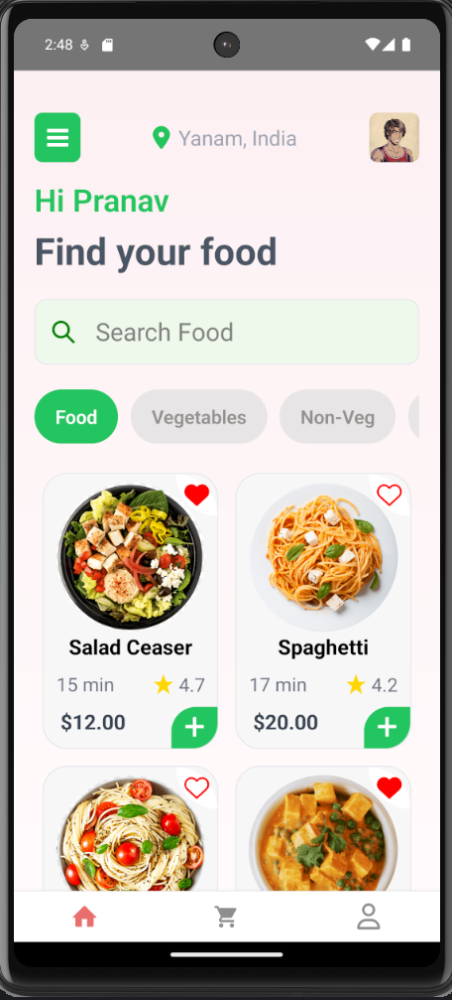
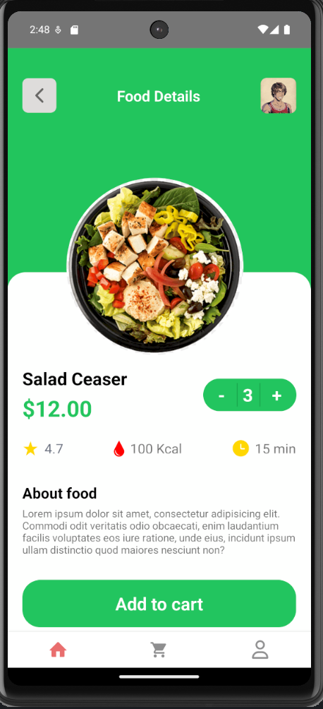
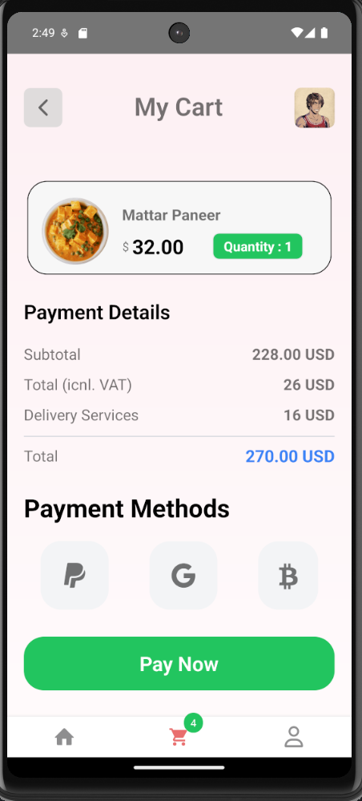

# Restaurant POS – Point of Sale System for Restaurants

Welcome to the Restaurant POS project! This React Native app is designed to streamline restaurant management with an efficient point-of-sale system.

## Project Demo

Check out the demo video of our Restaurant POS app:

[](https://www.youtube.com/watch?v=zZThbVfkbaU)

## Screenshots

Here are some screenshots of the app in action:





*Replace the image file paths with the actual paths where your images are stored.*

## Getting Started

To get started with this project, follow these steps:

### Prerequisites

Make sure you have completed the [React Native - Environment Setup](https://reactnative.dev/docs/environment-setup) instructions up to the "Creating a new application" step before proceeding.

### Step 1: Clone the Repository

Clone this repository to your local machine:

```bash
git clone https://github.com/pranavchaitu/pos-system.git
cd restaurant-pos
npm install / yarn
```

### Step 2: Install Dependencies

From the root of the cloned repository, install the required dependencies:

```bash
# using npm
npm install

# OR using Yarn
yarn install
```

### Step 3: Start the Metro Server

Start Metro, the JavaScript bundler that ships with React Native:

```bash
# using npm
npm start

# OR using Yarn
yarn start
```

### Step 4: Run the Application

Let Metro Bundler run in its own terminal. Open a new terminal from the root of your React Native project and run the following command to start your Android or iOS app:

```bash
# using npm
npm run android

# OR using Yarn
yarn android
```
For iOS

```bash
# using npm
npm run ios

# OR using Yarn
yarn ios
```
